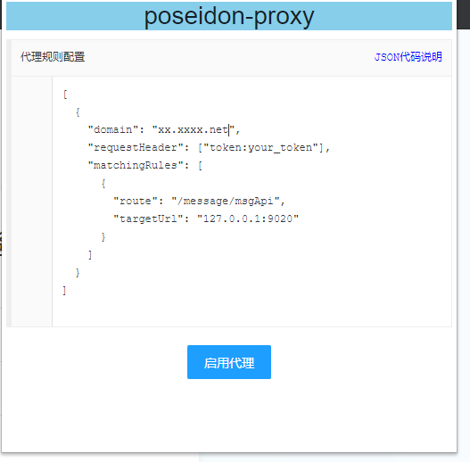

# 插件由来及功能

多年前和同事联调的时候，作为后端人员，在没有页面的情况下去自测总是测得很麻烦。当时前端的同事有个代理脚本可以直接将前端特定的请求代理到本地，拿过来后发现我们后端的开发也能用。
我们用这个脚本通过将测试环境的页面请求代理到本地来debug，省去了很多时间。当时这个脚本很简陋，只能手动去改源码来修改代理策略，当时就有了做个配置页面出来的想法，然后就有了这个项目。从后端开发的角度来说，这个插件的用处还是很大的，很方便。

# 插件原理

该插件原理是基于两个 `chrome extension` 的api 实现的，分别是 `chrome.proxy` , `chrome.webRequest.onBeforeSendHeaders` 。具体用法参考插件源码。


# 插件使用方式

## v1.0 版本说明

将插件 clone 到本地-》进入管理扩展程序的界面-》加载已解压的扩展程序-》选中clone的文件夹。

插件加载完成后，点击插件的图标，进入配置页面：
.png)

1. 打开开关
2. 输入你想被代理的前端域名 
3. 输入匹配路径，也就是你想被代理的url所包含的前几个字符串。
4. 输入目标路径，也就是代理服务器的 url

比如 我想将 www.baidu.com/xxx/a 代理到 127.0.0.1:8080/xxx/a 需要这样配置

.png)

目前不支持任意规则的匹配，预计v2.0 版本会完善.

## v2.1.0-beta 版本说明

2.1.0-beta 版本对ui界面及其功能都进行了较大升级

升级内容：

- 自动保存，1.0版本修改配置后需要点击保持按钮才能保持配置，十分不友好
- 多域名配置，1.0 版本只支持配单个域名的代理，2.1.0-beta 版本支持对多个域名的代理
- 请求头配置，支持修改代理请求的请求头，修改后立即生效；

使用说明：

安装方式参考1.0 版本

2.1.0-beta 版本界面如图所示：


不再通过输入框去配置代理信息，而使用json的格式完成配置。示例：

```json 
[
  {
    "domain": "dev.100yx.net",
    "requestHeader": ["test:xxxxxxxxxx"],
    "matchingRules": [
      {
        "route": "/message/msgApi",
        "targetUrl": "127.0.0.1:9020"
      }
    ]
  },  {
    "domain": "dev.200yx.net",
    "requestHeader": ["test:8888"],
    "matchingRules": [
      {
        "route": "/",
        "targetUrl": "127.0.0.1:8080"
      }
    ]
  }
]

```

点击json代码说明可查看字段含义。示例中是对两个域名 dev.100yx.net 和 dev.200yx.net 进行了代理；
凡是通过浏览器访问 http://dev.100yx.net/message/msgApi 开头的请求都会被代理到127.0.0.1:9020这个端口上去；
并且会添加请求头 test:xxxxxxxxxx。
如我访问 http://dev.100yx.net/message/msgApi/test 会被代理到 http://127.0.0.1:9020/message/msgApi/test 
请求头中会包含信息 test:xxxxxxxxxx。
dev.200yx.net 同理。

# 功能预定

- 修改响应头
